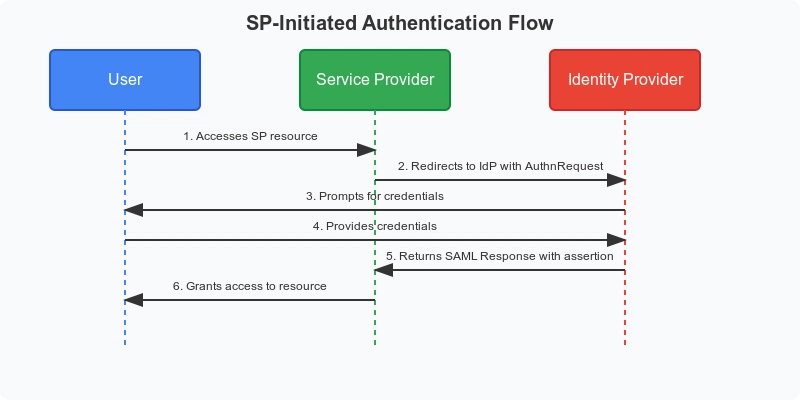

#### 인증(Authentication)
- '너 누구야?' 를 확인하는 과정
- ex) ID/PW, OTP, 지문, 인증서

#### 인가(Authorization)
- '너 여기 들어와도 돼?' 권한을 확인하는 과정
- ex) 관지라만 접근, 특정 부서만 메뉴 보이게 

> 인증 == 신원확인, 인가 == 권한 부여

#### 세션(Session)
- 로그인한 사용자를 서버가 기억하는 `로그인 상태`
- 보통 서버에 저장(메모리/DB/Redis), 브라우저엔 세션ID 쿠키만 둠

#### 토큰(Token)
- **로그인/권한이 있다는**는 증표
- 서버가 저장하지 않고, 토큰 자체로 인증/인가를 증명하기도 함(JWT 등)

### 통합인증(Integrated Authentication) 이란?
> 여러 시스템(서비스)의 로그인(인증)을 각 시스템이 직접하지 않고,
> 중앙의 인증시스템이 대신 처리하도록 통합하는 것

- 각 업무 시스템이 **로그인 판단**을 직접하지 않고, **중앙 인증 시스템(통합인증 서버)**에게 맡기는 구조

#### 통합인증이 아닌 것!
1) ID/비밀번호를 동일하게 쓰는 것
   - 시스템마다 로그인은 여전히 따로함
   - 그냥 "비밀번호만 같게 맞춘 상태"일 수 있음
2) 계정DB를 하나로 합치는 것
  - 계정 정보 저장소(사용자 테이블)을 통합해도, 시스템이 각자 로그인 처리하면 통합인증이 아님
3) 포털 하나 만들어 놓고 링크만 모아둔 것

#### 통합인증 서버(IdP)가 정확히 하는 일
통합인증 서버는 "로그인 화면"이 아니라, 아래 기능을 맡는 **플랫폼**에 가까움
##### ☑️ 필수기능
1. 사용자 인증(아이디/비번, 인증서 등)
2. 보안 정책 적용(잠금, 만료, 접속 제항)
3. 인증 성공/실패 로그 저장
4. 인증결과를 각 서비스에 전달(세션/토큰 발급)

##### ☑️ 자주 같이 붙는 기능
1. MFA/2FA(OTP, PUSH, SMS)
2. 비밀번호 재설정, 임시비번 발급
3. 계정상태(휴면/잠금/해제)
4. 관리자 콘솔(권한 관리, 통계)

### SSO(Single Sign-On) 이란?
> 한 번 인증(로그인)한 사실을 여러 서비스가 공유해서, 다른 서비스로 이동할 때 다시 로그인하지 않게 만드는 것
> 인증 상태(로그인 상태)가 공유되느냐가 SSO의 본질

#### 필요한 것!
1. 중앙 인증 주체
   - "이 사용자는 인증됨"을 판정하고 기록하는 것
2. 신뢰(Trust)
  - 각 서비스가 "중앙이 인증했다면 맏는다" 합의
  - 보통 서명키/공유키/인증서'서버 간 방화벽 등으로 구현
3. 인증 증표(세션/쿠키/토큰)
  - 인증 상태를 옮겨 담는 증표
  - SSO세션 + 쿠키
  - JWT/Access Token
  - Kerberos 티켓(JWA)

#### 방식
1. 세션 기반 SSO (Server-side SSO)
  - 중앙(SSO 서버)이 SSO세션을 보관
  - 각 서비스는 중앙에 물어봐서 "로그인 됨"을 확인
  - 브라우저는 쿠키(세션ID)만 들고 다님
2. 토큰 기반 SSO (Token-based SSO)
  - 중앙이 토큰(JWT 같은)을 발급
  - 각 서비스가 토큰을 검증해서 로그인 처리
  - 서버 저장소가 적거나 없어도 됨(무상태 가능)

#### SAML(Security Assertion Markup Language)
> 서로 다른 시스템(또는 조직) 간에 "인증 결과"를 안전하게 전달하기 위한 표준 프로토콜
- XML 기반
- 로그인 정보를 문서(Assertion) 형태로 전달
- 주 목적 -> SSO(특히 외부/연합 SSO)

#### 목표
- 비밀번호를 외부 서비스에 절대 주지 않는다!!
- 인증 책임은 내 조직(IdP)이 가진다.
- 외부서비스(SP)는 인증 결과만 신뢰
> SAML은 `신뢰 기반 인증 위임`이 핵심

#### 중요한 개념
1. IdP(`Identify Provider`)
   - 인증을 수행하는 쪽
   - "이 사용자는 누구고, 인증 완료됐다"를 보증
2. SP(`Service Provider`)
  - 실제 서비스를 제공하는 쪽
  - 로그인은 IdP에 위임

#### 핵심 구성 요소
1. Assertion
   SAML의 심장
  - XML 문서
  - IdP가 만들어서 SP에게 전달
  > 이 사용자는 이때 이렇게 인증되었다는 공식 증명서

2. Attribute
  Assertion 안에 포함되는 사용자 정보
  - SP는 이 Attribute로 계정 매핑, 권한 부여, 자동 계정 생성

3. Metadata
   IdP와 SP가 서로를 신뢰하기 위해 미리 교환하는 설정 정보
  > 이 상대는 내가 신뢰할 수 있는 상대다 를 설정으로 고정

