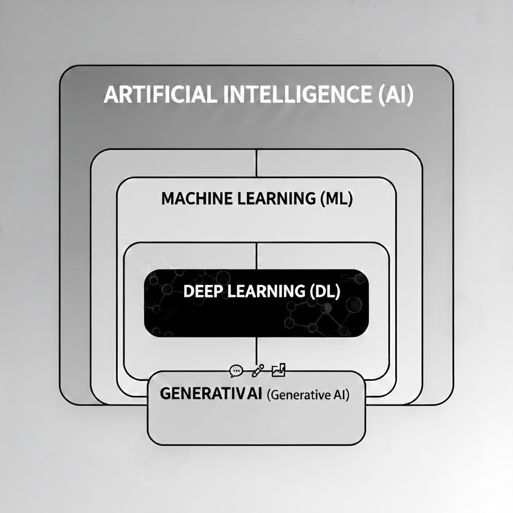

### AI ? 
> `AI(Artificial Intelligence)`는 인간의 지능을 모방하여 학습하고 문제를 해결하는 기술 전체를 아우르는 가장 넓은 개념
- 과거에는 일일이 규칙을 정해줘야 했으나, 현재는 데이터 속에서 스스로 규칙을 찾고 있음

#### 발전단계
지능 수준에 따라 보통 세 단계로 구분

|단계|명칭|특징|
|--|--|--|
|1단계|좁은 인공지능(ANI)|특정 작업만 수행(알파고, 번역기)|
|2단계|일반 인공지능(AGI)|모든 영역에서 인간과 대등한 지능|
|3단계|초인공지능(ASI)|모든 면에서 인간을 압도하는 지능|

#### ※ GPT나 제미나이 같은 AI 모델들은 1단계 넣기에는 똑똑해보이는데...?
  * 범용적이나, 아직은 '좁은 AI'인 이유
     - 학계에서는 현재의 LLM(거대언어모델)을 **범용 인공지능으로 가는 길목에 있는 좁은 AI**로 평가
     - 학습의 한계: 수많은 데이터로 '다음 단어를 예측하는 법'을 배웠고 모든 일을 다 하는 것 같찌만, 본질적으로는 `언어 생성'이라는 하나의 메커니즘으로 모든 결과를 도출
       - 최근 텍스트를 넘어 이미지, 영상, 오디오까지 생성하고 이해하는 단계인 `멀티모달 AI' 모델 이 나옴
       >  언어라는 사고의 중심축 위에 시각과 청각이라는 감각 기관이 합쳐진 형태로 발전하고 있다. 이것이 1단계를 넘어 2단계에 점점 가까워지고 있다고 말하는 핵심 이유 중 하나
     - 자율성 부재 : 스스로 목표를 설정하거나, 모르는 새로운 물리법칙을 스스로 발견할 수 없음. 입력(Prompt)이 있어야지만 반응하는 구조
     - 신뢰성 문제 : 정해진 규칙내에서는 완벽하게 작동하지만(ex. 계산기 등), 현재의 LLM은 복잡한 논리 구조에서 실수하거나 할루시네이션을 일으킴 ➡️ 아직 완전한 지능에 도달하지 못함
  * 2단계(AGI)로 가기위해 필요한 것들
    - 추론과 논리의 완벽함 : 확률적으로 단어를 뱉는게 아니라, 인간처럼 논리적 인과관계를 완벽히 이해해야 함
    - 지속적 학습 : 한 번 학습된 상태로 멈추는 게 아니라, 매일매일 겪는 일을 실시간으로 학습하고 기억해야 함
    - 멀티모달(Multimodal)의 통합 : 텍스트뿐 아니라 시각, 청각, 촉각 등 모든 감각 정보를 인간처럼 동시에 처리하고 이해해야 함

#### 왜 지금?
AI라는 개념은 1950년대부터 존재했으나, `딥러닝(Deep Learning)` 때문에 최근에 급격히 발전
- 신경망 구조 : 인간의 뇌세포(뉴런)가 신호를 주고받는 방식을 컴퓨터로 흉내
- 데이터와 연산 능력 : 인터넷 덕분에 학습할 데이터가 넘쳐나고, 이를 처리할 강력한 그래픽 카드(GPU)가 뒷받침되면서 AI 가 인간의 언어를 이해하는 수준까지 올라옴

#### AI와 다른 개념들의 관계

> **[Artificial Intelligence(AI)]** : 인간의 지능을 흉내내는 모든 기술 
> **[Machine Learning(ML)]** : 데이터를 통해 스스로 학습하는 AI의 한분야 
> **[Deep Learning(DL)]** ; 인간의 뇌구조를 모방한 신경망 학습 기술 
> **[Generative AI(생성형 AI)]** : 텍스트, 이미지 등을 새로 만드는 AI(LLM 이 여기에 포함)

